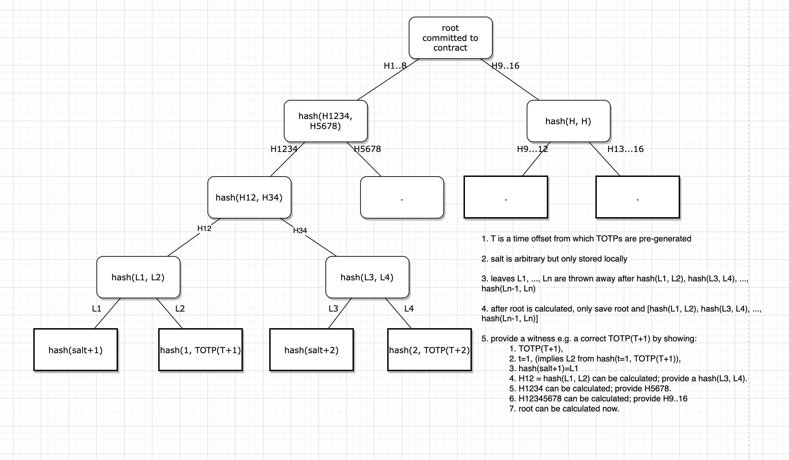

# Description

A smart contract wallet protected with 2FA (Google Authenticator) and optional social login. The wallet has protections in place to keep the user on allowed defi protocols and can only return funds to the owner in case an attacker gets access to the signing keys. The wallet makes it easy to create Superfluid money streams so that a company's accountant could use it to pay salaries without being able to steal or lose the company's funds.

Using Web3Auth for social logins, Google Authenticator for 2FA, Superfluid for money streaming, ERC-4337 account abstraction, Stackup bundler, deployed on Polygon and Base.

# Internal

We want to configure a smart contract wallet that requires knowledge of time-based one time pass (OTP) codes generated from an app like Google Authenticator but we don't want to keep the secret on the device. In order to verify that a code is correct without knowledge of the secret used to generate it, we will generate a list of future OTP codes and put them in a Merkle tree. We can then commit the root of the tree to the smart contract wallet, which can then verify witnesses that a future generated code is the correct code at a given time. The Merkle tree is structured like the image below.
 



# Setup Project

Do this:

```
yarn

yarn hardhat deploy --network localgeth

expect:
Generating typings for: 95 artifacts in dir: typechain for target: ethers-v5
Successfully generated 220 typings!
Compiled 91 Solidity files successfully
==entrypoint addr= 0x0576a174D229E3cFA37253523E645A78A0C91B57
==SimpleAccountFactory addr= 0x09c58cf6be8E25560d479bd52B4417d15bCA2845

yarn ts-node erc-4337-examples/scripts/init.ts

# edit contract addresses
vi erc-4337-examples/config.json

yarn ts-node erc-4337-examples/scripts/simpleAccount/index.ts address

# fund that address (bundler should already have funds)
(in geth) eth.sendTransaction({from: eth.coinbase, to: "<ADDRESS>", value: web3.toWei(1, "ether")})

# time to mix things up

# generate ts artifacts for any custom contracts
sh scripts/prepack-contracts-package.sh

yarn ts-node erc-4337-examples/scripts/complexAccount/index.ts address
# assume it's funded
yarn ts-node erc-4337-examples/scripts/complexAccount/index.ts transfer --to <ANYADDRESS> --amount 0.0001

# assume WETH deployed at 0x1507a792AFc83Ce8AEB7D84B520F28b147378629
yarn ts-node erc-4337-examples/scripts/complexAccount/index.ts mintWeth --token 0x1507a792AFc83Ce8AEB7D84B520F28b147378629 --amount 0.001

```
